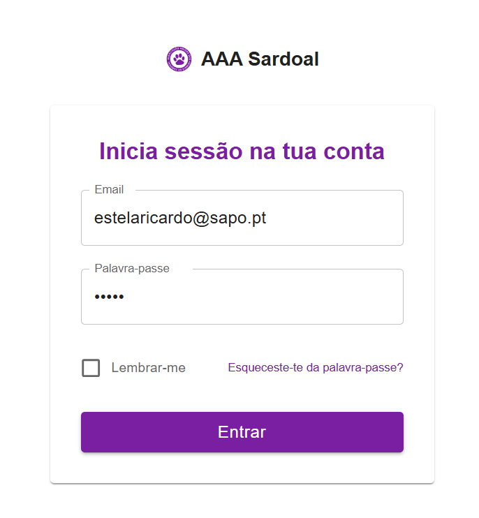
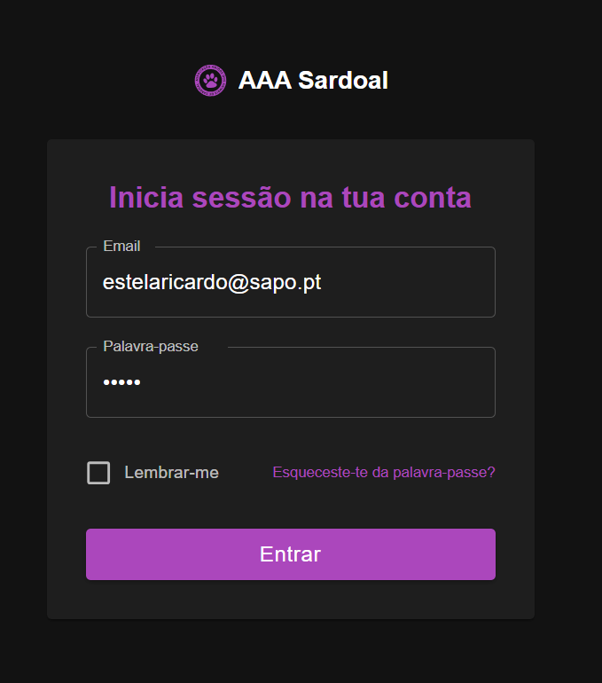
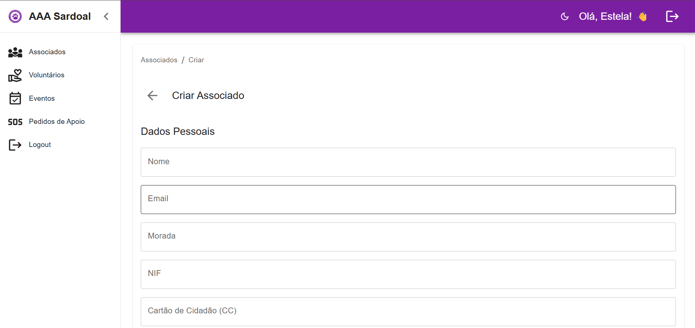
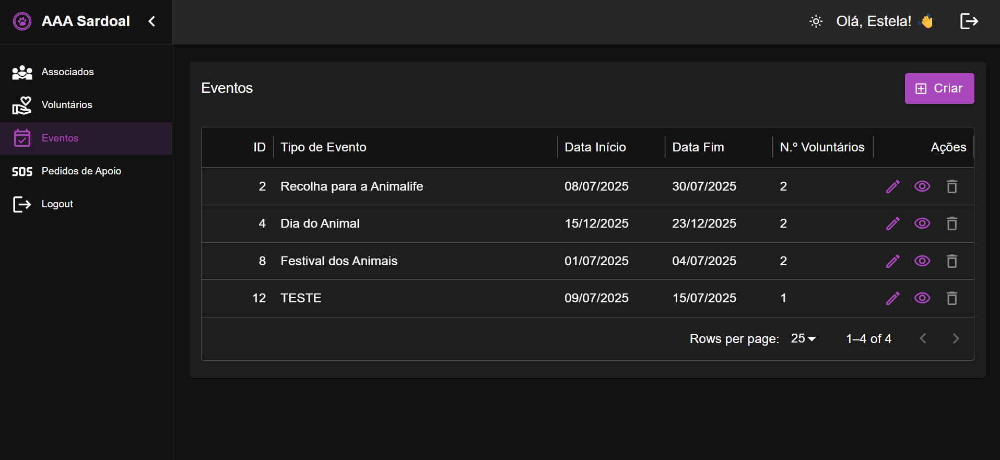
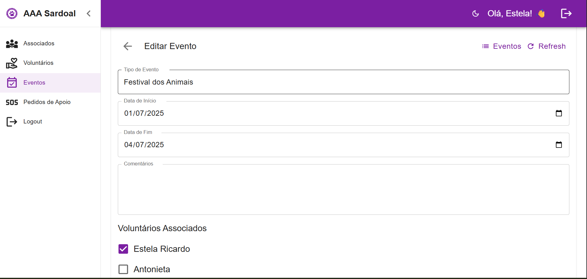
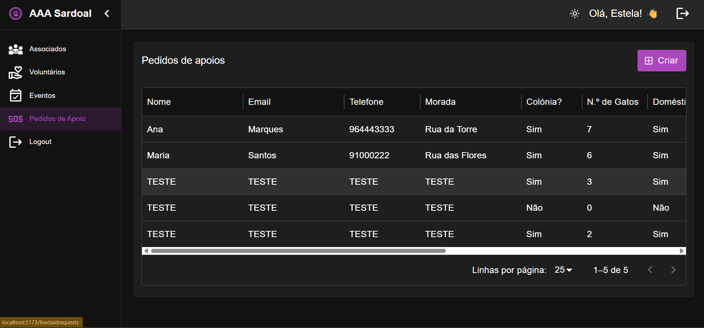
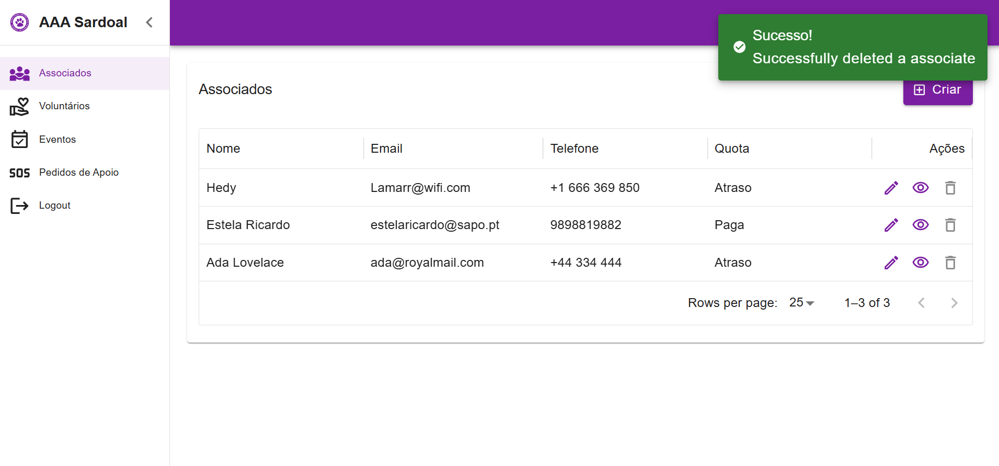

<div align="center">

# 🧩 CRM da Associação

[](https://refine.dev/)
[](https://supabase.com/)
[](LICENSE)

Sistema de Gestão de Sócios, Voluntários, Eventos e Apoio Alimentar, desenvolvido como trabalho final da **UFCD 5425 - Projeto Final**, no âmbito do curso de **Técnico Especialista em Tecnologias e Programação de Sistemas de Informação**.
</div>

---

## 📌 Objetivo

> Construir um CRM funcional para uma associação sem fins lucrativos, permitindo gerir associados, voluntários, eventos, atividades e pedidos de ajuda alimentar, com um backend seguro e um frontend moderno.

---

## 🛠️ Tecnologias Utilizadas

### Frontend

- ⚛️ [React](https://reactjs.org/) + [TypeScript](https://www.typescriptlang.org/)
- 🚀 [Refine](https://refine.dev) (`@refinedev/mui`)
- 🎨 [Material UI](https://mui.com/)
- ⚡ [Vite](https://vitejs.dev/)
- 📋 [React Hook Form](https://react-hook-form.com/)

### Backend

- 🛢️ [Supabase](https://supabase.com/) (PostgreSQL + Auth)

---

## 🔐 Segurança Implementada

- Autenticação com Supabase
- Proteção de rotas via `authProvider`
- Validação de sessão com persistência
- Verificação de email e recuperação de palavra-passe (esquecida)
- Controlo de acesso ao conteúdo (ACL)
- **(Nota)**: CAPTCHA e MFA não foram integrados nesta versão

---

## 📁 Funcionalidades

### 👤 Gestão de Sócios
- Criar, editar, listar e ver detalhes de sócios
- Integração com tabela `user` (via FK `id_user`)
- View `associates_full` para queries completas

### 🧑‍🤝‍🧑 Gestão de Voluntários
- Componentes dedicados para voluntários
- Integração com dados de utilizador (nome, email)
- View `volunteers_full` para listagens

### 📦 Pedidos de Ajuda Alimentar
- Registo e gestão de pedidos
- Filtros por estado e detalhes individuais

### 📅 Gestão de Eventos (em desenvolvimento)
- Criação e listagem de eventos
- Ligação com voluntários e inscrições

### ⚙️ Melhorias Gerais
- Refatoração contínua dos componentes
- Otimização de UX/UI
- Redirecionamento manual via `useNavigate().push()` para controlo granular

---

## 🚀 Primeiros Passos

Para correr o projeto localmente:

```bash
# Clonar o repositório
git clone https://github.com/.git
cd crm-associacao

# Instalar dependências
npm install

# Iniciar o servidor de desenvolvimento
npm run dev

```


## 🖼️ Capturas de Ecrã

 







## 👥 Autores

<div align="center">

| Nome               |  GitHub                                          |  LinkedIn                                               |
|--------------------|---------------------------------------------------------------------------------------------------------------|-----------------------------------------------------------------------------------------------------------------------------|
| Estela Ricardo     | [@Estela-Ricardo](https://github.com/Estela-Ricardo)                                                          | [linkedin.com/in/estelaricardo](https://www.linkedin.com/in/estelaricardo/)                                                 |
| Joana Barroqueiro  | [@joanabb](https://github.com/joanabb)                                                                         | [linkedin.com/in/joanabarbosab](https://www.linkedin.com/in/joanabarbosab/)                                                 |

</div>

## 📜 Licença

MIT © 2025 — Projeto educativo sem fins lucrativos.

<div align="center">Feito com ❤️ para ajudar a ajudar.</div>
